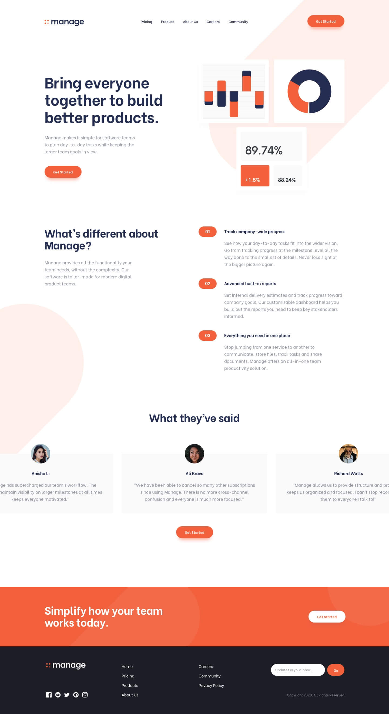

# Frontend Mentor - Manage landing page solution

This is a solution to the [Manage landing page challenge on Frontend Mentor](https://www.frontendmentor.io/challenges/manage-landing-page-SLXqC6P5). Frontend Mentor challenges help you improve your coding skills by building realistic projects. 

## Table of contents

  - [The challenge](#the-challenge)
  - [Screenshot](#screenshot)
  - [Links](#links)
  - [Built with](#built-with)
  - [Continued development](#continued-development)
- [Author](#author)
- [Acknowledgments](#acknowledgments)

### The challenge

Users should be able to:

- View the optimal layout for the site depending on their device's screen size
- See hover states for all interactive elements on the page
- See all testimonials in a horizontal slider
- Receive an error message when the newsletter sign up `form` is submitted if:
  - The `input` field is empty
  - The email address is not formatted correctly

### Screenshot

### Links

- Solution URL: [Add solution URL here](https://github.com/Ernest2026/Websites/manage-landing-page-master/)
- Live Site URL: [Add live site URL here](https://w-e-b.netlify.app/manage-landing-page-master/)

### Built with

- Semantic HTML5 markup
- CSS custom properties
- Flexbox
- CSS Grid
- Mobile-first workflow
- Javascript

### Continued development

I would like to build a better website with more awesome animation added to it on scroll...

## Author

- Frontend Mentor - [@Ernesto](https://www.frontendmentor.io/profile/Ernest2026)
- Twitter - [@Ernesto](https://www.twitter.com/Ernesto_13355)

## Acknowledgments

I built this landing page with the help of [W3schools](https://w3schools.com) and [Stackoverflow](https://stackoverflow.com)...
